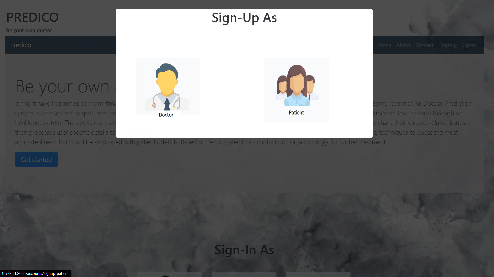
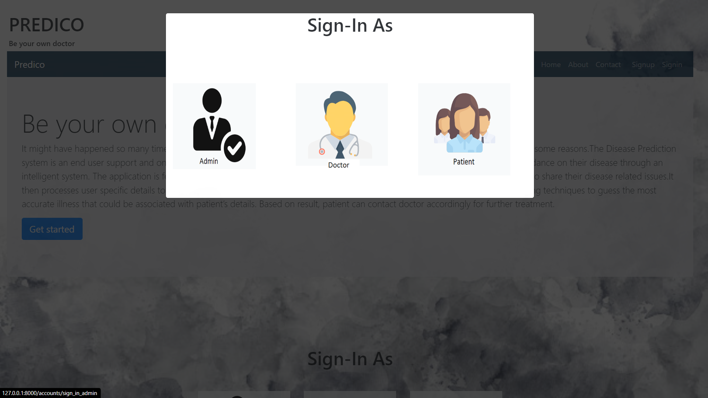
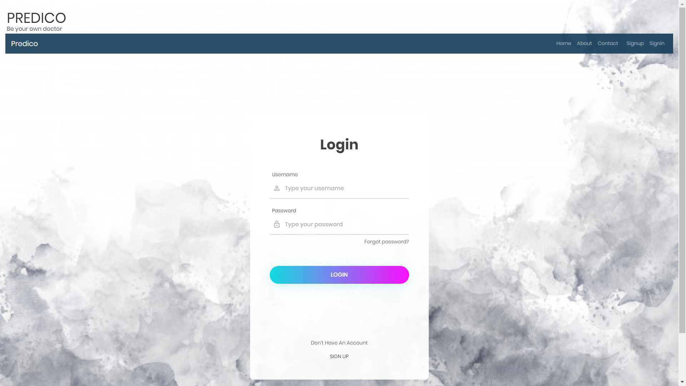
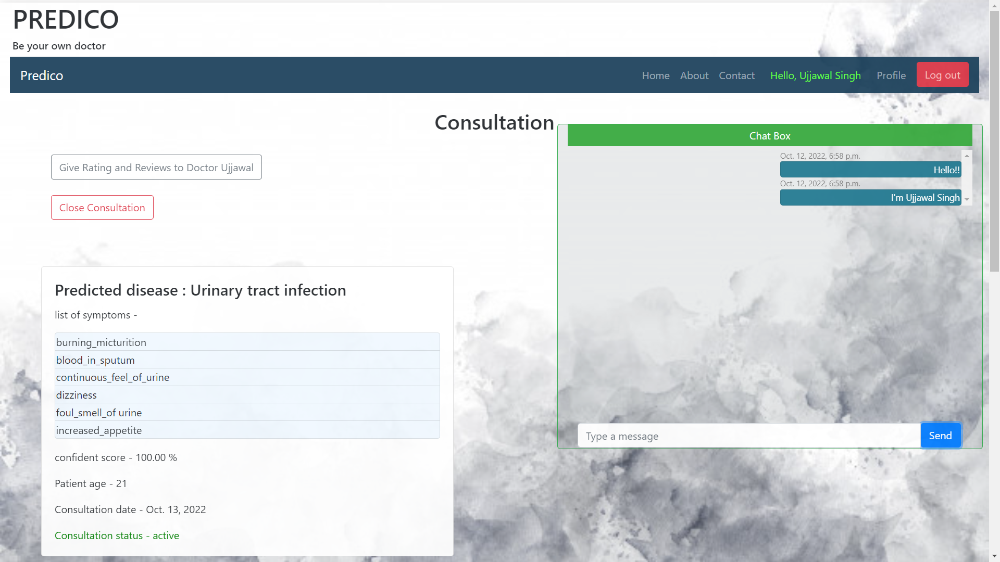

# <p align="center">Project Installations in Local System</p>

## Tools & Technology Required

- Python
- Django
- HTML
- CSS
- Javascript
- Machine Learning
- PostgreSQL

<p align="center">


  
 
 


</p>

## Run Locally

- Download the Project and Unzip it
- Open Commant Prompt
> You must have Python3 installed in your system


Go to the project directory
```bash
cd Health_And_Disease_Prediction_System
```

Create Virtual Envoirnment of Python
```bash
pip install virtualenvwrapper-win
```

Make Virtual Envoirnment as I named it `venv`
```
mkvirtualenv venv
```
Open Virtual Envoirnment as

```bash
workon venv
```

Install Dependencies

```bash
    pip install -r requirenments.txt
```

Start the Server
```bash
python manage.py runserver
```
Or

You can install virtual environment using pip:
```
py -m pip install --user virtualenv
```
For creating new environment:
```
py -m venv myproject
```
To activate your virtual environment:
```
.\myproject\Scripts\activate
```

>   Development Server started at `localhost:8000`

<hr>

# <p align="center"> Development Documentations</p>

**Install Django in Virtual Envoirnment**

## Installation
Run this command to install `virtual wrapper` which will allows you to make virtual envoirnment
```
pip install virtualenvwrapper-win
```

Make Virtual Envoirnment as name `venv`
```
mkvirtualenv venv
```

Open the Command Prompt in Project Directory as
C:\Users\Ujjawal\Coding\Web Developement\MajorProject> `workon venv`

```
workon venv
```

Install `Django` in Virtual Envoirnment as
(venv) C:\Users\Ujjawal\Coding\Web Developement\MajorProject>pip install django
```
pip install django
```

Run this to Check `django-admin` Available Subcommands:
```
django-admin
```

Now, Create Django-Project by using django-admin subcommands
as `django-admin startproject` (projectName)
```
django-admin startproject project
```

<hr>

# <p align="center">Project Demonstration</p>

## Home


## SignUp Popup


## SignIn Popup


## Login Page



## Doctor Home Page


## Patient Home Page


## Consult Page


## Chat Page


<hr>


